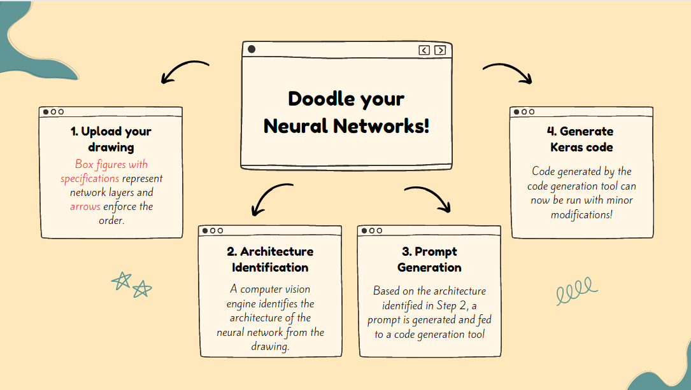
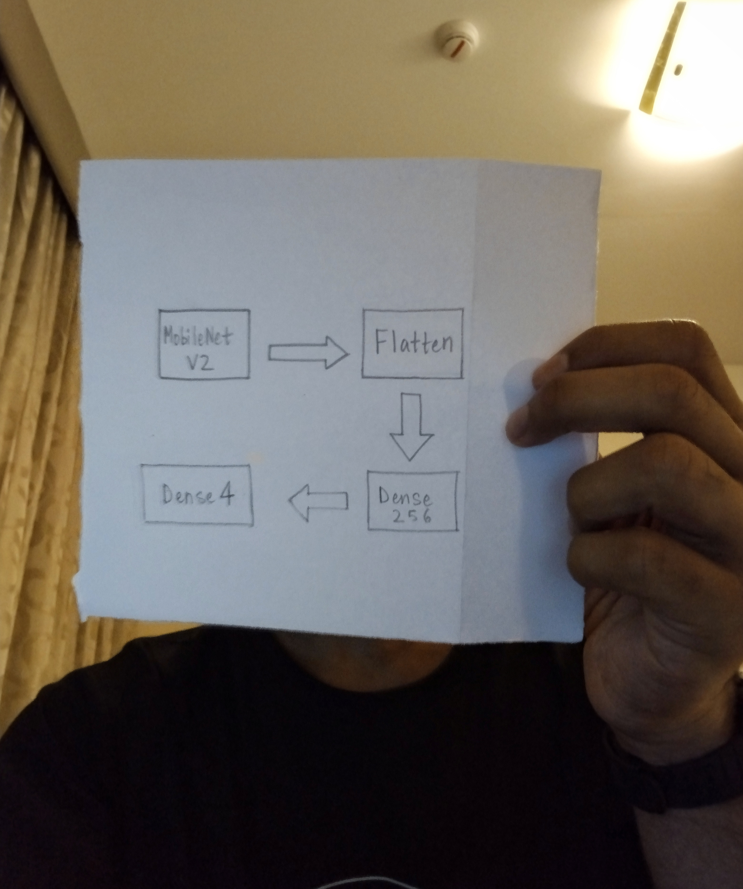
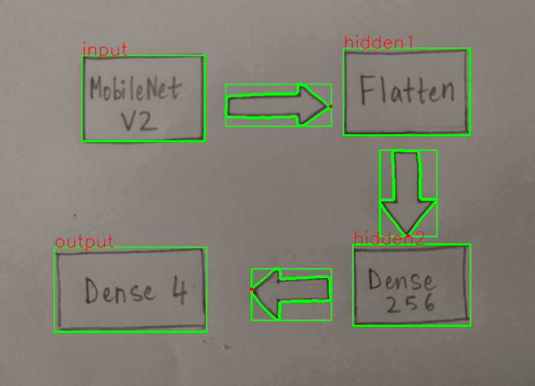
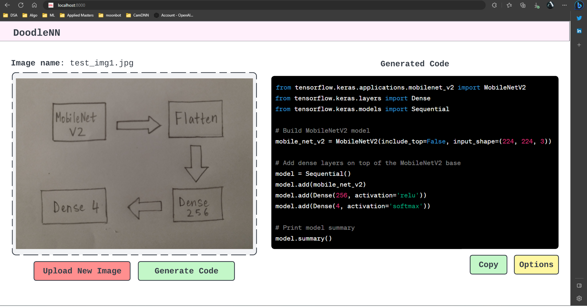

# Doodle your Neural Network!

I built a tool that allows users to draw a sketch of a neural network and convert it to code!

### Approach 

 

### Take a picture of your doodle 

 

### Computer Vision at work 

 

### Website 

 